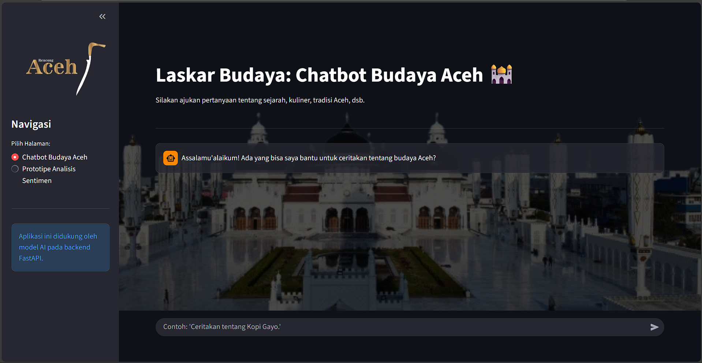
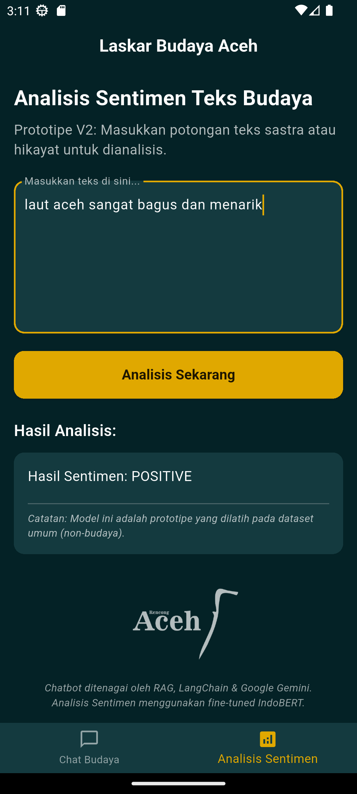
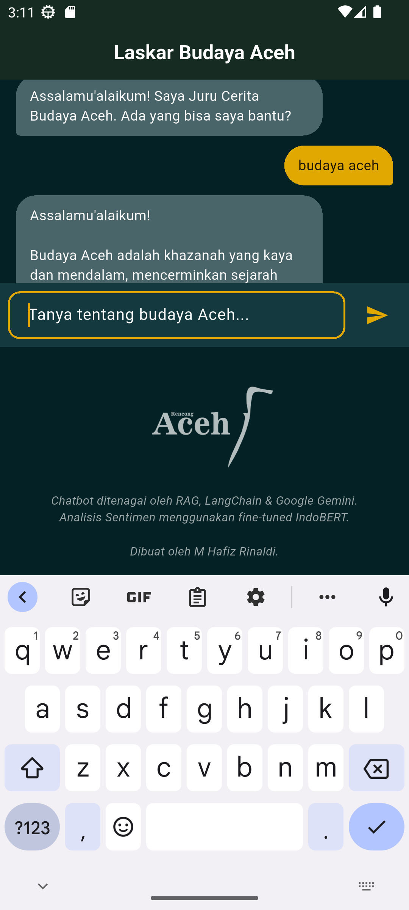
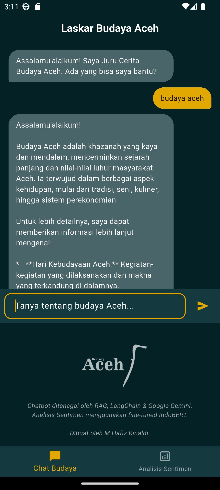
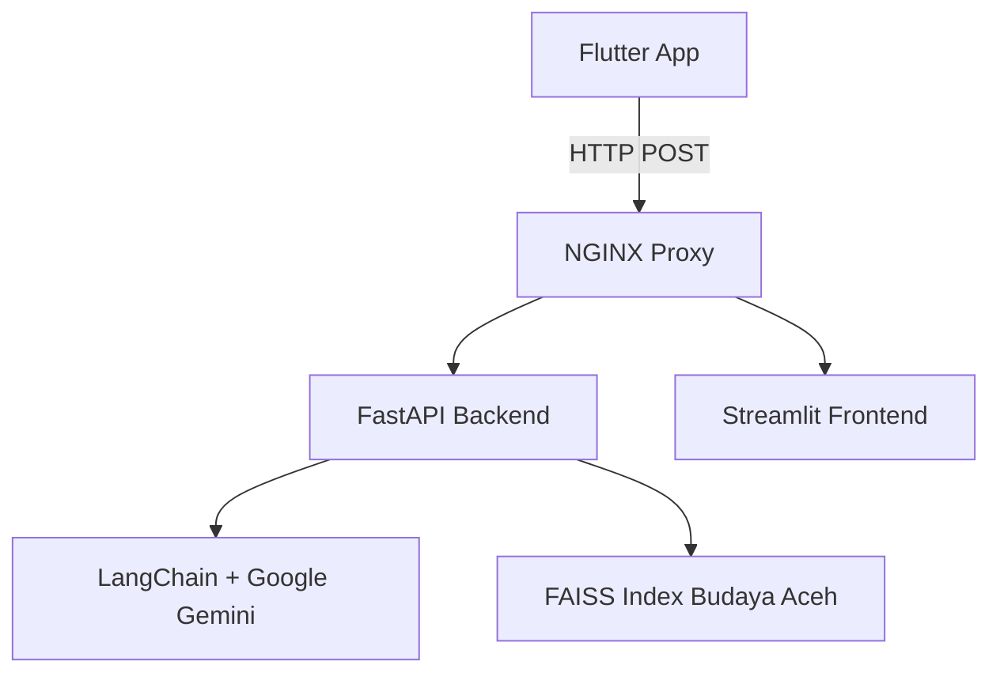

# 🕌 RencongAI — Chatbot Budaya Aceh

**RencongAI** adalah aplikasi kecerdasan buatan yang saya kembangkan dengan tujuan untuk **memperkenalkan, mendokumentasikan, dan melestarikan budaya Aceh**, daerah tempat saya dibesarkan dan yang menjadi sumber inspirasi utama saya.

Sebagai putra daerah Aceh, saya ingin menunjukkan bahwa teknologi modern khususnya **Artificial Intelligence (AI)** dapat digunakan untuk **memajukan nilai-nilai budaya lokal**, bukan hanya mengikuti arus globalisasi.  
RencongAI hadir sebagai wujud dari semangat tersebut.

---

### 💬 Fitur Utama
- **Chatbot Interaktif Budaya Aceh**  
  Menjawab berbagai pertanyaan tentang sejarah, adat istiadat, sastra, kuliner, dan tradisi Aceh dengan pendekatan RAG (Retrieval-Augmented Generation) menggunakan **LangChain + Google Gemini**.

- **Analisis Sentimen Sastra (Prototipe)**  
  Fitur eksperimental berbasis **IndoBERT fine-tuned**, yang dapat menganalisis emosi dan makna dari teks sastra seperti **hikayat, syair, dan pantun Aceh**.

---

### 💡 Inspirasi Pengembangan
RencongAI lahir dari keinginan saya untuk **memajukan daerah sendiri** dan membuktikan bahwa inovasi teknologi tidak hanya milik pusat-pusat industri besar, tetapi juga bisa tumbuh dari akar budaya lokal.  
Melalui proyek ini, saya berharap generasi muda Aceh dapat melihat bahwa **AI bukan ancaman bagi budaya**, melainkan alat untuk menjaga dan menyebarkan warisan leluhur kita ke dunia.

---

## 🌐 Tampilan Aplikasi

### 💻 Web Interface


### 📱 Android Interface
<p align="center">
  
  
  
</p>

---

## 🧠 Cara Kerja

RencongAI menggunakan pendekatan **RAG (Retrieval-Augmented Generation)**:
1. Mengambil konteks budaya Aceh dari **FAISS index** (dokumen budaya lokal).  
2. Mengirimkan konteks ke **Google Gemini** melalui **LangChain**.  
3. Menghasilkan jawaban natural dan akurat.  

Fitur **Analisis Sentimen Sastra (Prototipe)** menggunakan **IndoBERT fine-tuned** untuk memprediksi emosi teks (positif, negatif, netral).

---

## 🧩 Fitur Utama

| Fitur | Deskripsi |
|--------|------------|
| 🗣️ **Chat Budaya Aceh** | Menjawab pertanyaan seputar sejarah, adat, sastra, dan budaya Aceh. |
| ❤️ **Analisis Sentimen (Prototipe)** | Prediksi emosi teks sastra (positif/negatif/netral). |
| 🧠 **RAG System** | Menggabungkan retrieval (FAISS) dan generatif (Gemini). |
| 📚 **FAISS Indexing** | Basis data teks budaya lokal Aceh. |
| 🧰 **Streamlit Web UI** | Antarmuka web testing & demo. |
| 🪶 **Flutter UI** | Aplikasi mobile dengan tema khas Aceh. |
| 🐳 **Dockerized Deployment** | Semua komponen berjalan dalam satu container menggunakan NGINX reverse proxy. |

---

## 🧱 Arsitektur Sistem



---

## 📂 Struktur Project

```
rencongAI-main/
├── rencongAI-hafiz/       # Backend (FastAPI + Streamlit + NGINX)
│   ├── main.py
│   ├── frontend.py
│   ├── requirements.txt
│   ├── Dockerfile
│   ├── start.sh
│   └── nginx.conf
│
├── frontend_android/      # Frontend Flutter
├── assets/
│   └── screenshots/
│       ├── web_chat.png
│       ├── android_home.png
│       ├── android_chat.png
│       └── android_sentiment.png
└── README.md
```

---

## ⚙️ Instalasi & Menjalankan Aplikasi

### 🔧 Backend (Manual - FastAPI + Streamlit)

```bash
cd rencongAI-hafiz
python -m venv venv
source venv/bin/activate   # Windows: venv\Scripts\activate
pip install -r requirements.txt
uvicorn main:app --host 127.0.0.1 --port 8000
```

---

### 🐳 Deployment Menggunakan Docker

Proyek ini sudah **sepenuhnya ter-containerisasi**.  
Gunakan perintah berikut untuk membangun dan menjalankan aplikasi secara lokal atau di Hugging Face:

```bash
cd rencongAI-hafiz

# Build image
docker build -t rencongai .

# Jalankan container
docker run -p 7860:7860 rencongai
```

📦 **Container ini otomatis menjalankan:**
- FastAPI pada port internal `8000`  
- Streamlit pada port `8501`  
- NGINX yang menyatukan semuanya di port publik `7860`  

Di Hugging Face Spaces, sistem otomatis menjalankan `start.sh` untuk memulai semua proses.

---

### 📱 Frontend (Flutter)

```bash
cd frontend_android
flutter pub get
flutter run
```

Pastikan variabel backend sudah diarahkan ke API Hugging Face:
```dart
const String BACKEND_URL = 'https://manok45-rencongai-hafiz.hf.space/api';
```

---

## 🧰 Catatan Penting

- **Analisis Sentimen = PROTOTIPE**: gunakan untuk eksplorasi awal.  
- Jangan commit file model besar (`*.pth`, `*.pt`) ke GitHub.  
- Simpan kunci API (`GOOGLE_API_KEY`) sebagai secret di Hugging Face Spaces.  
- Dockerfile sudah termasuk konfigurasi NGINX & cache fix (`/tmp/nginx`, `/.cache`).

---

## 🧰 Teknologi Stack

| Layer | Teknologi | Deskripsi |
|--------|------------|------------|
| **Frontend (Mobile/Web)** | Flutter | UI modern bertema Aceh |
| **Frontend Web (Demo)** | Streamlit | Antarmuka web demo chatbot |
| **Backend API** | FastAPI | Framework backend ringan & cepat |
| **AI Orchestration** | LangChain | Pipeline RAG + integrasi Gemini |
| **LLM Model** | Google Gemini | Model bahasa untuk respons kontekstual |
| **Retriever** | FAISS | Indexer dokumen budaya Aceh |
| **Sentiment Model** | IndoBERT | Model klasifikasi emosi (Prototipe) |
| **Proxy Server** | NGINX | Reverse proxy internal untuk FastAPI + Streamlit |
| **Deployment** | Docker + Hugging Face Spaces | Containerisasi penuh dengan auto-run |
| **Version Control** | GitHub | Repositori publik proyek |

---

## 👨‍💻 Pengembang

**M. Hafiz Rinaldi**  
🎓 Pengembang RencongAI — Chatbot Budaya Aceh  
🖋️ FastAPI · Flutter · LangChain · Docker · Hugging Face Spaces

---

## 🪪 Lisensi
Proyek ini dirilis di bawah [MIT License](LICENSE).

---

## 🌟 Dukungan
Berikan ⭐ di GitHub untuk mendukung pelestarian budaya Aceh melalui teknologi 💛
